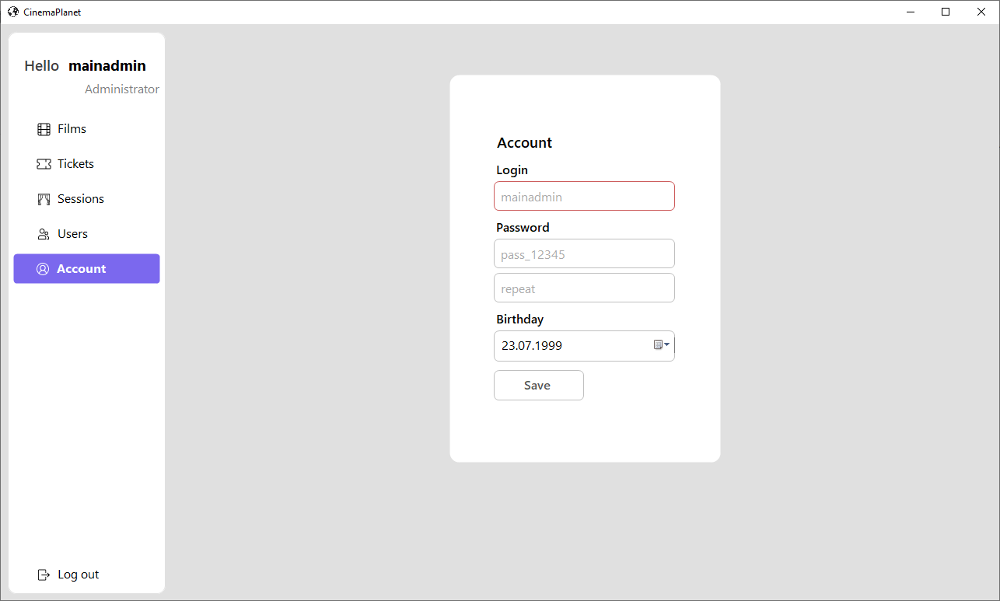
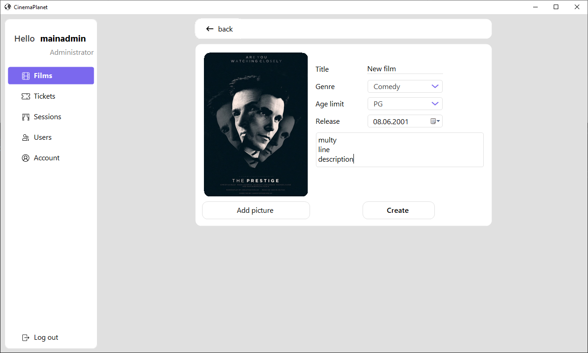
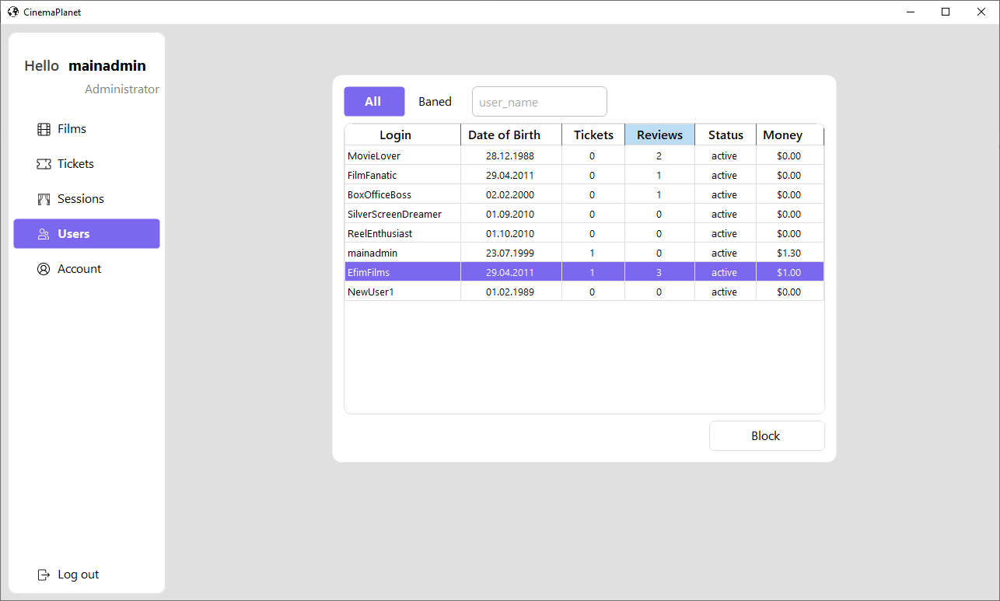
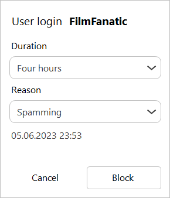

<h1 align="center">
    Cinema Network Desktop Application
</h1>

## Description
This is a desktop application that simulates a ticket shop

- Movie feed: On the main page of the application, users can see the current movie feed that is available for purchasing tickets. Each film is accompanied by a poster, a title and a short description.
- Convenient Search: Users can use the convenient search by movie title and genre to quickly find the content they are interested in.
- Unauthorized Users: This type of user can view movie pages, read comments from other users, and obtain ticket information using special codes. They also have access to the session schedule.
- Authorized Users: After registering and logging in, users are able to leave comments on films, buy tickets for screenings, view and modify their profile information. This allows users to interact with content on a deeper level.
- Administrators: The admin panel allows you to add new movies and sessions to the database, edit information about them, and block users if necessary. This provides control over the content and security of the platform.

## App screens

  
  
  

  
  
  

  
  
  

  

